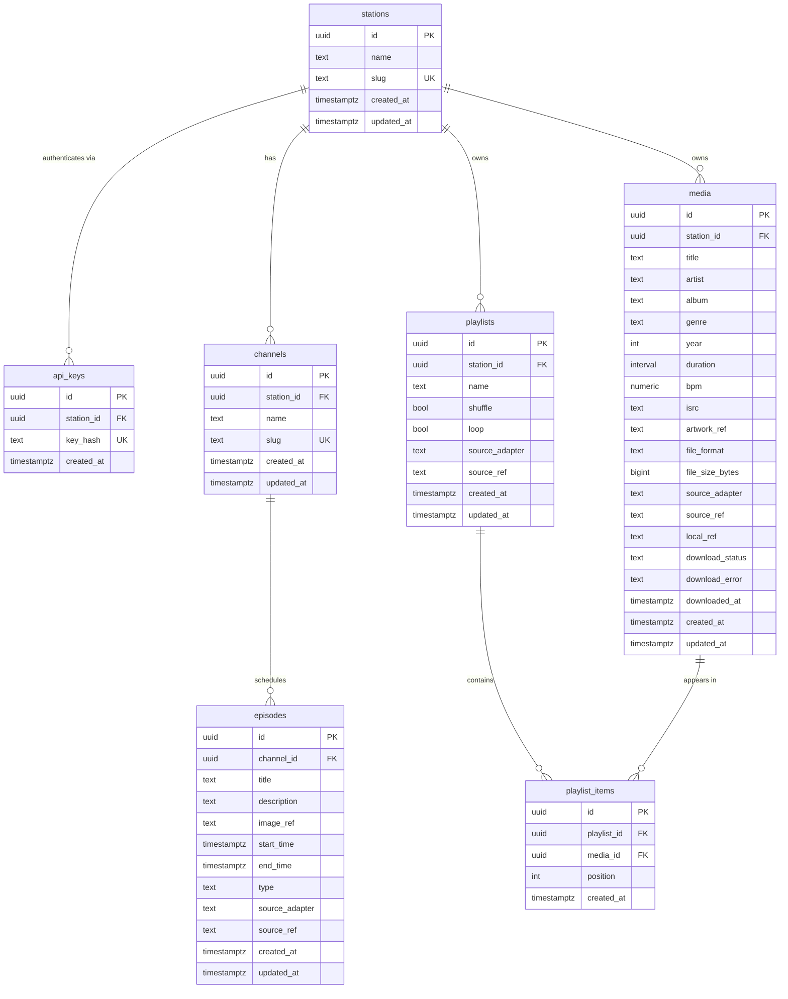

# database schema

```mermaid
erDiagram
    stations {
        uuid id PK
        text name
        text slug UK
        timestamptz created_at
        timestamptz updated_at
    }

    api_keys {
        uuid id PK
        uuid station_id FK
        text key_hash UK
        timestamptz created_at
    }

    channels {
        uuid id PK
        uuid station_id FK
        text name
        text slug UK
        timestamptz created_at
        timestamptz updated_at
    }

    episodes {
        uuid id PK
        uuid channel_id FK
        text title
        text description
        text image_ref
        timestamptz start_time
        timestamptz end_time
        text type
        text source_adapter
        text source_ref
        timestamptz created_at
        timestamptz updated_at
    }

    media {
        uuid id PK
        uuid station_id FK
        text title
        text artist
        text album
        text genre
        int year
        interval duration
        numeric bpm
        text isrc
        text artwork_ref
        text file_format
        bigint file_size_bytes
        text source_adapter
        text source_ref
        text local_ref
        text download_status
        text download_error
        timestamptz downloaded_at
        timestamptz created_at
        timestamptz updated_at
    }

    playlists {
        uuid id PK
        uuid station_id FK
        text name
        bool shuffle
        bool loop
        text source_adapter
        text source_ref
        timestamptz created_at
        timestamptz updated_at
    }

    playlist_items {
        uuid id PK
        uuid playlist_id FK
        uuid media_id FK
        int position
        timestamptz created_at
    }

    stations ||--o{ api_keys : "authenticates via"
    stations ||--o{ channels : "has"
    stations ||--o{ media : "owns"
    stations ||--o{ playlists : "owns"
    channels ||--o{ episodes : "schedules"
    playlists ||--o{ playlist_items : "contains"
    media ||--o{ playlist_items : "appears in"
```
