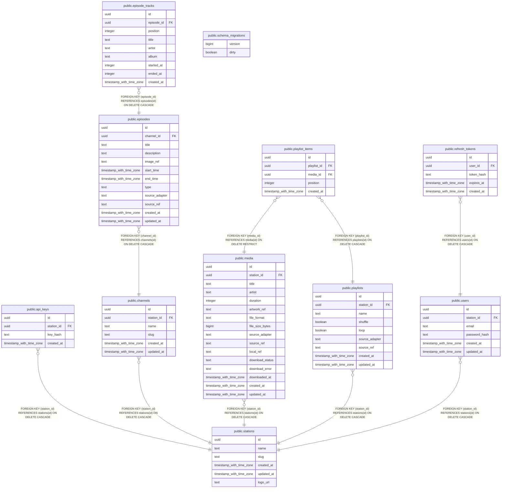

# radiooo

## Tables

| Name                                                    | Columns | Comment | Type       |
| ------------------------------------------------------- | ------- | ------- | ---------- |
| [public.schema_migrations](public.schema_migrations.md) | 2       |         | BASE TABLE |
| [public.stations](public.stations.md)                   | 6       |         | BASE TABLE |
| [public.api_keys](public.api_keys.md)                   | 4       |         | BASE TABLE |
| [public.channels](public.channels.md)                   | 6       |         | BASE TABLE |
| [public.episodes](public.episodes.md)                   | 12      |         | BASE TABLE |
| [public.media](public.media.md)                         | 16      |         | BASE TABLE |
| [public.playlists](public.playlists.md)                 | 9       |         | BASE TABLE |
| [public.playlist_items](public.playlist_items.md)       | 5       |         | BASE TABLE |
| [public.episode_tracks](public.episode_tracks.md)       | 9       |         | BASE TABLE |
| [public.users](public.users.md)                         | 6       |         | BASE TABLE |
| [public.refresh_tokens](public.refresh_tokens.md)       | 5       |         | BASE TABLE |

## Relations

---

> Generated by [tbls](https://github.com/k1LoW/tbls)
